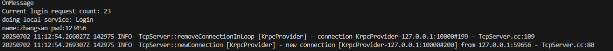
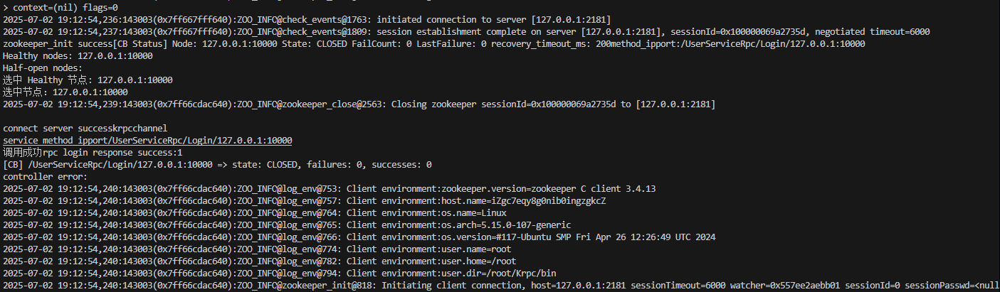
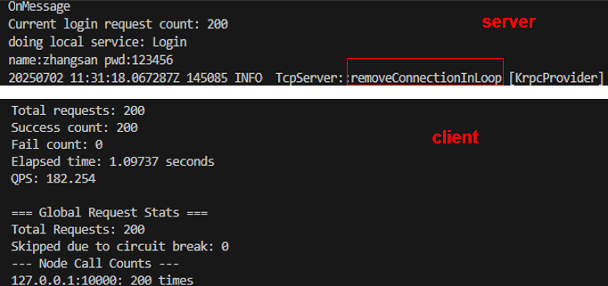
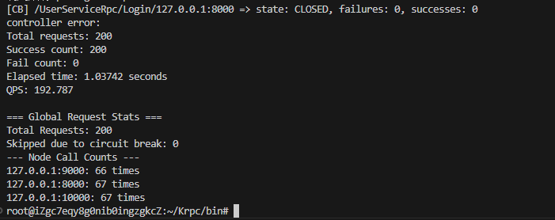
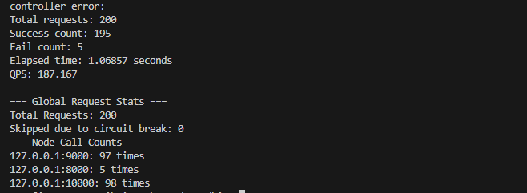
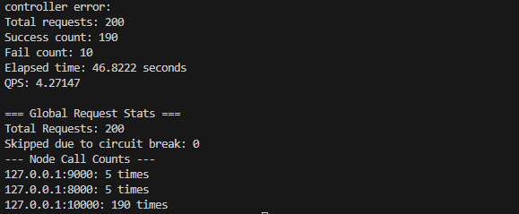
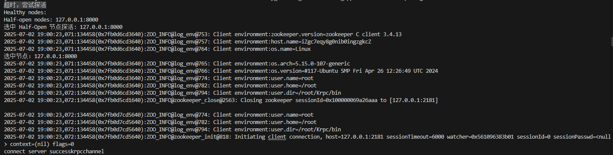
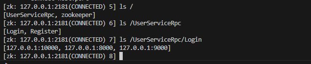

# C++ 分布式网络通信框架 (Tiny_Krpc)

本项目基于protobuf的 C++ 分布式网络通信框架，使用ZooKeeper 作为服务注册与发现的中间件。它旨在解决分布式服务部署中的核心问题，并提供高并发、可扩展的远程过程调用（RPC）服务。

## 核心特性
*   **服务注册与发现：** 通过 ZooKeeper 实现服务的**发布**与**订阅/调用**。
*   **高效通信：**
    *   使用 Protobuf 进行消息的**序列化与反序列化**。
    *   自定义消息体格式，有效**解决 TCP 粘包问题**，确保网络包的可靠收发。
*   **高可用与容错：**
    *   **负载均衡：** 将客户端请求智能地分发到集群中可用的服务节点。
    *   **熔断机制：** 当节点持续返回错误时，客户端自动将其**隔离**，避免故障扩散。
    *   **探活机制：** 对熔断节点进行**健康检查**，在其恢复后自动重新纳入服务池。

目前项目实现了上述部分，如果后续有需求再继续完善

# 项目运行结果分析

## 基础功能分析

通过运行 `bin` 目录下的 `server` 和 `client`，可以观察到以下结果。以下是运行日志中的关键步骤和解析：

---

### 服务端运行结果



- **运行结果说明**：该图展示了服务器成功启动并监听客户端请求的状态。

**服务器日志解析**：
- `Current login request count: 23`
  - 对调用Login次数的统计（分布式缓存，redis实现了跨服务器的函数调用次数统计）
- `doing local service: Login`  
  - 表示客户端发起对服务 `Login` 的调用。
- `name: zhangsan pwd: 123456`  
  - 客户端向服务端发送了用户名 `zhangsan` 和密码 `123456`。
- `new connection`  
  - 客户端成功与服务端建立了一条新连接。

---

### 客户端运行结果



- **运行结果说明**：该图展示了客户端成功连接到服务器并发送请求的状态。

**客户端日志解析**：
- `Healthy nodes: 127.0.0.1:10000`  
  - 表示当前的服务器127.0.0.1:10000是能够正常工作的。
- `Half-open nodes:`  
  - 当前不存在待探活节点。
- `rpc login response success:1`  
  - 表示客户端的登录请求成功，服务器返回响应值 `1`。
- `session establishment complete on server`  
  - 表示与 Zookeeper 的会话成功建立，服务端已注册在 Zookeeper 中。
- `connect server success`  
  - 表示服务端成功连接到目标地址。

**客户端工作步骤**：
 1. 连接zookeeper
 2. 返回特定节点下的数据（这里是`/UserServiceRpc/Login`节点）
 3. 在返回的节点中选择正常工作节点
 4. 与选中节点建立连接并请求服务
 5. 请求服务后断开连接
---

### 最终运行结果

通过运行 `bin` 目录下的 `server` 和 `client` 可执行程序，最终结果如下：


- **最终结果说明**：该结果表明客户端与服务端成功完成了一次 RPC 通信，包括服务调用、请求处理和结果返回，验证了框架的稳定性和功能性。
## 负载均衡
开启了三台服务器
**服务器1**：127.0.0.1:8000
**服务器2**：127.0.0.1:9000:
**服务器3**：127.0.0.1:10000:
随后通过客户端发起了200次请求，每台服务器均衡的处理了来自客户端的`200`次请求，平均为`66`次



## 熔断机制 
## 服务器1模拟出错
此时模拟服务器1 出错，我这里设置的熔断阈值是5次，当探测超过5次就失败,此时服务器2，服务器3都正确。

此时通过5次探测发现服务器1失败，开启服务器1的熔断，并将后续请求均匀的负载到服务器2和服务器3上去。

## 服务器1模拟出错且服务器2模拟超时
此时模拟服务器1 出错，服务器2 模拟超时（设置的是超时5秒就返回错误了），当探测超过5次就失败,此时服务器3正常工作。

此时通过5次探测发现服务器1失败，开启服务器1的熔断；
此时通过5次探测发现服务器2超时，开启服务器2的熔断；
并将后续请求将负载到服务器3上去。


# 探活机制
模拟服务器1在前半段工作错误，后半段时间正常工作（但实际服务是空服务，执行比较快。）


## Zookeeper查看
查看zookeeper节点连接情况
找到`zkCli.sh`的安装位置，我的在（`/usr/share/zookeeper/bin`）
然后连接zookeeper服务器
·
```shell
locate zkCli.sh #定位zkCli.sh所在位置
cd /usr/share/zookeeper/bin #进入zkCli.sh对应文件夹
./zkCli.sh -server 127.0.0.1:2181 #连接zookeeper
```



## 各部分作用

- **muduo库**：负责数据流的网络通信，采用了多线程epoll模式的IO多路复用，让服务发布端接受服务调用端的连接请求，并由绑定的回调函数处理调用端的函数调用请求。

- **Protobuf**：负责RPC方法的注册，数据的序列化和反序列化，相比于文本存储的XML和JSON来说，Protobuf是二进制存储，且不需要存储额外的信息，效率更高。

- **Zookeeper**：负责分布式环境的服务注册，记录服务所在的IP地址以及端口号，可动态地为调用端提供目标服务所在发布端的IP地址与端口号，方便服务所在IP地址变动的及时更新。

- **TCP沾包问题处理**：定义服务发布端和调用端之间的消息传输格式，记录方法名和参数长度，防止沾包。

- **Glog日志库**：后续增加了Glog的日志库，进行异步的日志记录。


# Tiny-Krpc
